**Google Search Console - in PHP**

A show case project for executing Google web search from within the console using PHP, then write the results to a PDF file.

To do so, we have to have a Google account in order to setup a project there and get an API Key.

## Prerequisites

### At PHP level: 
* readline library
* PHP version >= 5.6

### 1. Get Google API Key 
  While logged in to your Google Account, follow these steps:
  ##### 1. Navigate to [https://console.developers.google.com](https://console.developers.google.com) and create a new project
  
  
  
  Select project:
  
  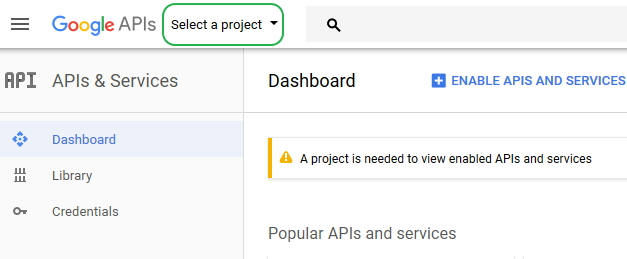  
  
  
  Project add-new:
  
  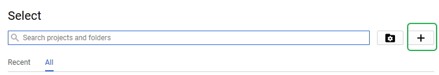
  
  Project choose name and create:
  
  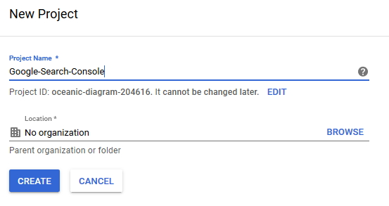
  
  ##### 2. Within the developer console, generate a new API Key for that Project just created
  Go to credentials and select a project:

  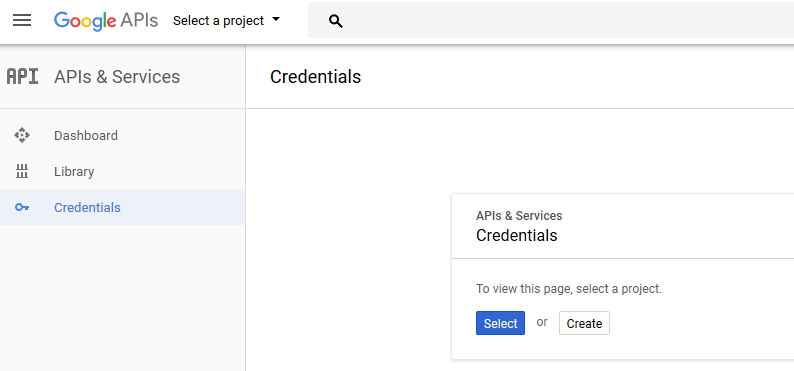
  
  Create an API Key Credentials:

  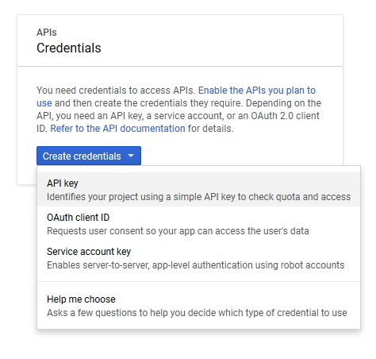
  
  #### Then copy the key and keep it.
  
  
  
  ##### 3. Navigate to the Dashboard and add the Custom Search API Service to the project
  Go to Dashboard and click enable APIs:

  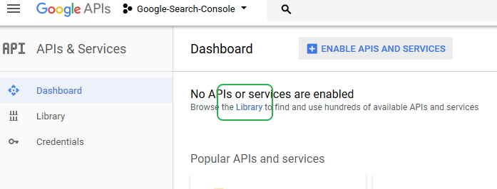
  
  Search for 'search':

  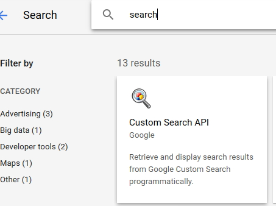
  
  select the 'Custom Search':

  
  
  Enable Service:

  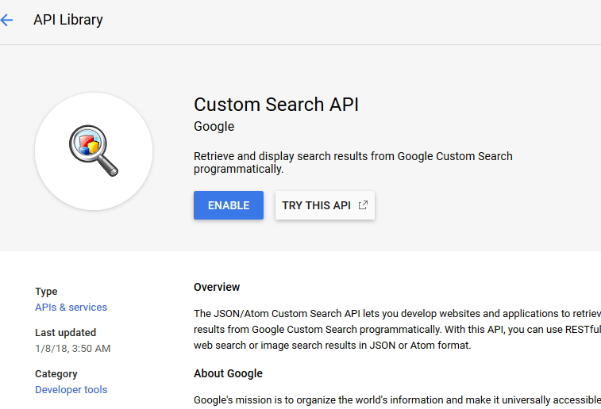
  
    

  ### 2. Generate Search Engine ID
  Also while logged in to Google Account, follow these steps:
  ##### 1. Navigate to [https://www.google.com/cse/all](https://www.google.com/cse/all) and create a new custom search
  Create new Custom Search:

  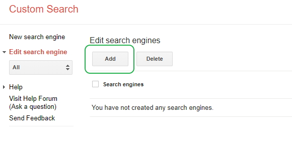
  
  In the "Sites to Search" enter "www.google.com" then click "Create"
  Enter site and click create:

  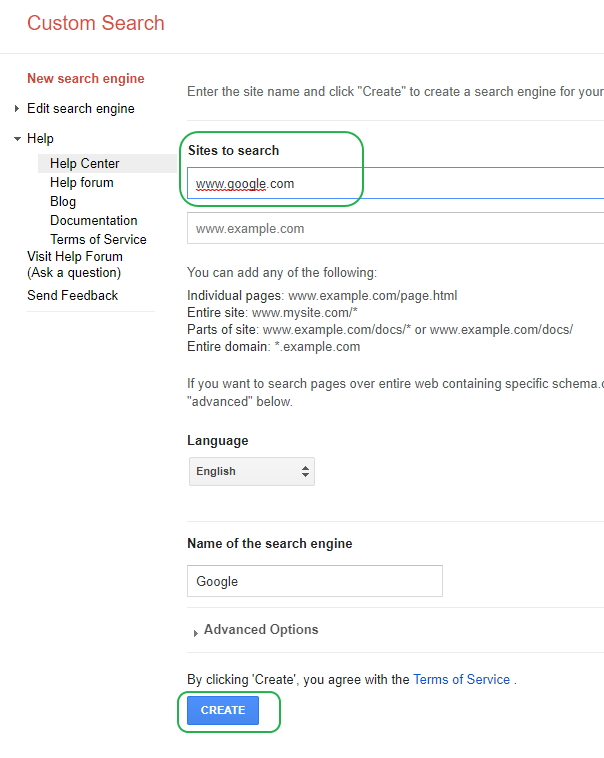
  
  On the left navigation pane, head to "Edit search engine" and select "Setup" leaf.
  Edit the "Sites to Search" and select "Search the entire web but emphasize included sites".
  Then click "Update" at the bottom to save.
  Enable Search Entire web:

  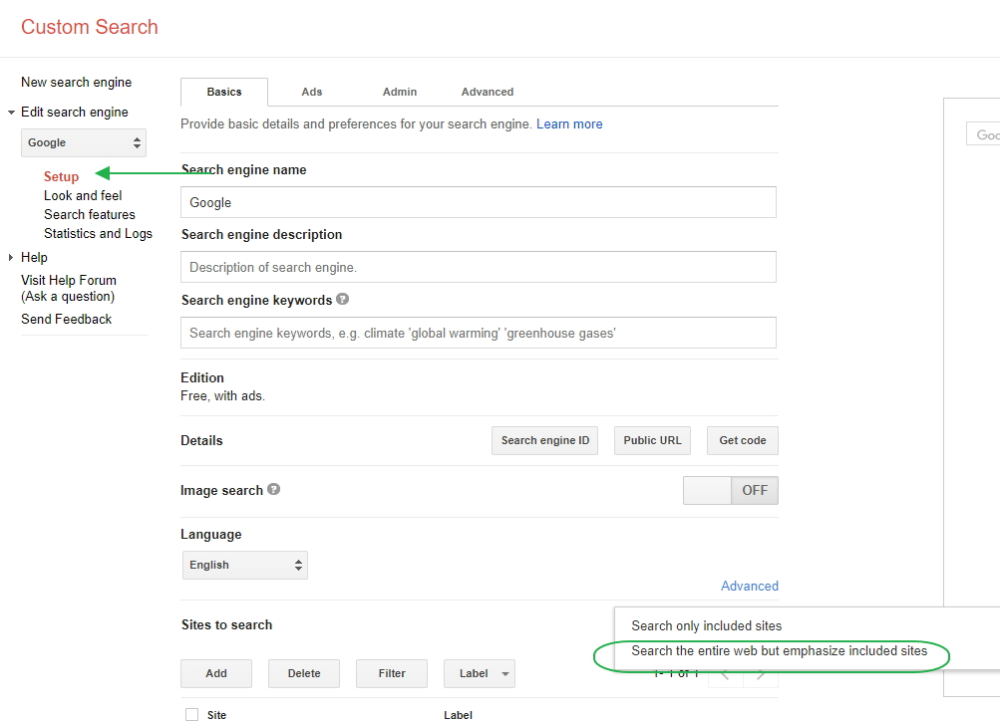
 
  In the same page, click on "Search Engine ID" to get the ID needed, copy it.
  Get Search Engine ID:

  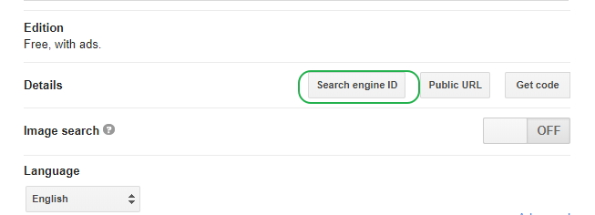
 
  Get Search Engine ID:

  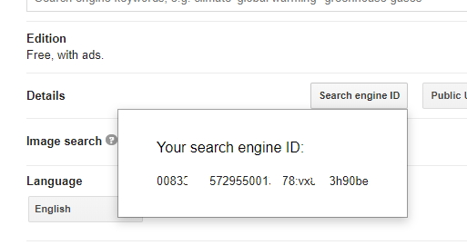
 

  
## Usage
Clone the repo and install the required packages using composer.
In project directory execute:
```
composer install
```

Then update the ```keys.json``` file in project directory to add your "API Key" and "Search Engine ID" generated above.

Basic Usage:
```
php ./google-search.php <Phrase to search> <Number of Results>
```
Both the <Phrase> and the <Number of results> are required.

If you have troubles with SSL Certificates (on WAMP stack mostly), use the ```--no-verify``` command line option to skip SSL verification.

Use ```--help``` to print the available options


